# Design Document: FoundryVTT VsD System

## Overview

This document describes the technical design for a FoundryVTT v14 game system implementing "Against the Darkmaster" (VsD) by Open Ended Games. The system provides digital character sheets, automated open-ended d100 dice mechanics, combat tracking with a 9-phase Tactical Round Sequence, spell casting with Magical Resonance detection, and compendium data for drag-and-drop gameplay.

The architecture separates pure game logic (dice math, table lookups, rank calculations) from FoundryVTT-dependent code (document models, application sheets, hooks). This separation enables comprehensive property-based testing of core rules via Vitest + fast-check while keeping Foundry integration in dedicated modules.

**Key Design Decisions:**

1. **TypeScript + Vite build**: Source lives in `src/`, output goes to `dist/`. Vite handles TS compilation and static asset copying. The `vite-plugin-foundryvtt` package bridges hot-reload during development.
2. **TypeDataModel over template.json**: All Actor and Item types use the v14 `TypeDataModel` class with `defineSchema()` for type-safe data definitions, registered via `documentTypes` in system.json.
3. **ApplicationV2 sheets**: All sheets extend `ApplicationV2` using the tab-based architecture and V2 CSS variables/patterns.
4. **Pure engine layer**: Functions in `src/engine/` accept all dependencies as parameters, have no side effects, and import nothing from Foundry. This makes them trivially testable.
5. **Bilingual localization**: All user-facing strings use `VSD.{Section}.{Label}` keys with `en.json` and `es.json` translation files.

## Architecture

```mermaid
graph TD
    subgraph "Build Layer"
        VITE[Vite + vite-plugin-foundryvtt]
        TS[TypeScript Compiler]
        SRC[src/]
        DIST[dist/]
        SRC --> TS --> VITE --> DIST
    end

    subgraph "Runtime Layer (FoundryVTT v14)"
        SJ[system.json<br/>documentTypes + esmodules]
        
        subgraph "src/engine/ (Pure Logic)"
            DICE[dice-engine.ts]
            ART[action-resolution.ts]
            RANK[rank-bonus.ts]
            ENC[encumbrance.ts]
            SPELL[spell-casting.ts]
            ATK[attack-tables.ts]
            TRAVEL[travel.ts]
        end

        subgraph "src/models/ (TypeDataModel)"
            CHAR_M[CharacterDataModel]
            NPC_M[NpcDataModel]
            WEAP_M[WeaponDataModel]
            ARMOR_M[ArmorDataModel]
            SPELL_M[SpellDataModel]
            EQUIP_M[EquipmentDataModel]
            KIN_M[KinDataModel]
            CULT_M[CultureDataModel]
            VOC_M[VocationDataModel]
            TRAIT_M[TraitDataModel]
            IOP_M[ItemOfPowerDataModel]
        end

        subgraph "src/sheets/ (ApplicationV2)"
            CHAR_S[CharacterSheet]
            NPC_S[NpcSheet]
            ITEM_S[ItemSheet]
            WIZARD[CharacterCreationWizard]
            COMBAT[VsdCombatTracker]
            ADV[AdvancementPanel]
            TRAV_S[TravelPanel]
        end

        subgraph "src/data/"
            TABLES[Attack & Critical Tables JSON]
            LEVELS[Level Progression JSON]
        end

        subgraph "src/lang/"
            EN[en.json]
            ES[es.json]
        end

        subgraph "src/styles/"
            CSS[*.css]
        end
    end

    subgraph "Testing Layer"
        VITEST[Vitest]
        FC[fast-check]
        VITEST --> DICE
        VITEST --> ART
        VITEST --> RANK
        VITEST --> ENC
        VITEST --> SPELL
        VITEST --> ATK
        FC --> VITEST
    end

    CHAR_S --> CHAR_M
    CHAR_S --> DICE
    CHAR_S --> RANK
    NPC_S --> NPC_M
    NPC_S --> DICE
    NPC_S --> ATK
    COMBAT --> DICE
    WIZARD --> CHAR_M
    WIZARD --> RANK
    ADV --> RANK
```



### Directory Structure

```
src/
├── engine/                  # Pure logic (zero Foundry imports)
│   ├── dice-engine.ts       # Open-ended d100 roll computation
│   ├── action-resolution.ts # ART outcome band lookup
│   ├── rank-bonus.ts        # Skill rank → bonus calculation
│   ├── encumbrance.ts       # Encumbrance level determination
│   ├── spell-casting.ts     # Spell total + resonance detection
│   ├── attack-tables.ts     # Attack/critical table lookup
│   └── travel.ts            # Travel duration computation
├── models/                  # TypeDataModel subclasses
│   ├── actor/
│   │   ├── character.ts     # CharacterDataModel
│   │   └── npc.ts           # NpcDataModel
│   └── item/
│       ├── weapon.ts
│       ├── armor.ts
│       ├── spell.ts
│       ├── equipment.ts
│       ├── kin.ts
│       ├── culture.ts
│       ├── vocation.ts
│       ├── trait.ts
│       └── item-of-power.ts
├── sheets/                  # ApplicationV2 subclasses
│   ├── character-sheet.ts
│   ├── npc-sheet.ts
│   ├── item-sheet.ts
│   ├── combat-tracker.ts
│   ├── creation-wizard.ts
│   ├── advancement-panel.ts
│   └── travel-panel.ts
├── data/                    # Static JSON data tables
│   ├── attack-tables/
│   ├── critical-tables/
│   └── level-progression.json
├── lang/
│   ├── en.json
│   └── es.json
├── styles/
│   └── vsd-system.css
├── templates/               # Handlebars HTML templates
│   ├── actors/
│   └── items/
└── vsd-system.ts            # Entry point (hooks, registration)
```

## Components and Interfaces

### 1. Pure Engine Functions (`src/engine/`)

Each engine module exports pure functions with no side effects and no Foundry imports.

#### dice-engine.ts

```typescript
/** Random number source interface for dependency injection */
type RollSource = () => number; // Returns 1-100 inclusive

interface RollResult {
  total: number;
  rolls: { value: number; type: 'initial' | 'high-explode' | 'low-explode' | 'final' }[];
  isOpenEndedHigh: boolean;
  isOpenEndedLow: boolean;
}

/** Compute open-ended d100 roll. Max 10 explosions. */
export function computeOpenEndedRoll(source: RollSource): RollResult;

/** Format a RollResult into display components for chat */
export function formatRollDisplay(result: RollResult): string;
```

#### action-resolution.ts

```typescript
type OutcomeBand = 'CriticalFailure' | 'Failure' | 'PartialSuccess' | 'Success' | 'OutstandingSuccess';

/** Lookup outcome band from total. Accepts any integer including negatives. */
export function resolveAction(total: number): OutcomeBand;
```

#### rank-bonus.ts

```typescript
/** Compute rank bonus from rank value. Rank must be >= 0. */
export function computeRankBonus(rank: number): number;
```

#### encumbrance.ts

```typescript
type EncumbranceLevel = 'Unencumbered' | 'LightlyEncumbered' | 'Encumbered' | 'HeavilyEncumbered' | 'OverEncumbered';

interface EncumbrancePenalties {
  maneuver: number;
  movement: number;
  allSkills: number;
}

/** Determine encumbrance level from total points and Brawn stat value. */
export function determineEncumbranceLevel(totalPoints: number, brawn: number): EncumbranceLevel;

/** Get penalties for a given encumbrance level. */
export function getEncumbrancePenalties(level: EncumbranceLevel): EncumbrancePenalties;
```

#### spell-casting.ts

```typescript
/** Detect Magical Resonance from an initial d100 value (11-99 range). */
export function detectMagicalResonance(d100Value: number): boolean;

/** Compute spell casting total. */
export function computeSpellTotal(
  skillBonus: number,
  rollResult: number,
  casterLevel: number
): number;
```

#### attack-tables.ts

```typescript
type ArmorCategory = 'NA' | 'LA' | 'MA' | 'HA';
type CriticalSeverity = 'Superficial' | 'Light' | 'Moderate' | 'Grievous' | 'Lethal';

interface AttackResult {
  damage: number;
  critical: { severity: CriticalSeverity; tableRef: string } | null;
}

/** Lookup attack table result. Returns error for unknown tableId. */
export function lookupAttackTable(
  rollTotal: number,
  tableId: string,
  armorCategory: ArmorCategory,
  tables: Map<string, AttackTableData>
): AttackResult | { error: string };
```

#### travel.ts

```typescript
type TravelPace = 'Careful' | 'Normal' | 'Fast' | 'ForcedMarch';

/** Compute travel duration in hours. */
export function computeTravelDuration(
  distanceMiles: number,
  pace: TravelPace,
  terrainModifier: number,
  partyMovementRate: number
): number;
```

### 2. TypeDataModel Classes (`src/models/`)

Each model class extends `foundry.abstract.TypeDataModel` and implements `defineSchema()` using Foundry's `SchemaField`, `NumberField`, `StringField`, `ArrayField`, etc.

#### CharacterDataModel (key fields)

```typescript
class CharacterDataModel extends foundry.abstract.TypeDataModel {
  static defineSchema() {
    return {
      stats: new SchemaField({
        brn: new NumberField({ integer: true, min: -50, max: 100, initial: 0 }),
        swi: new NumberField({ integer: true, min: -50, max: 100, initial: 0 }),
        for: new NumberField({ integer: true, min: -50, max: 100, initial: 0 }),
        wit: new NumberField({ integer: true, min: -50, max: 100, initial: 0 }),
        wsd: new NumberField({ integer: true, min: -50, max: 100, initial: 0 }),
        bea: new NumberField({ integer: true, min: -50, max: 100, initial: 0 }),
      }),
      hp: new SchemaField({
        value: new NumberField({ integer: true, min: 0, initial: 0 }),
        max: new NumberField({ integer: true, min: 0, initial: 0 }),
      }),
      mp: new SchemaField({
        value: new NumberField({ integer: true, min: 0, initial: 0 }),
        max: new NumberField({ integer: true, min: 0, initial: 0 }),
      }),
      drivePoints: new SchemaField({
        value: new NumberField({ integer: true, min: 0, initial: 0 }),
        max: new NumberField({ integer: true, min: 0, initial: 0 }),
      }),
      passions: new SchemaField({
        nature: new StringField({ max: 500, initial: '' }),
        allegiance: new StringField({ max: 500, initial: '' }),
        motivation: new StringField({ max: 500, initial: '' }),
      }),
      heroicPath: new SchemaField({
        description: new StringField({ max: 200, initial: '' }),
        milestones: new ArrayField(new SchemaField({
          text: new StringField({ required: true }),
          completed: new BooleanField({ initial: false }),
        })),
      }),
      defense: new NumberField({ integer: true, initial: 0 }),
      encumbrance: new StringField({
        choices: ['Unencumbered', 'LightlyEncumbered', 'Encumbered', 'HeavilyEncumbered', 'OverEncumbered'],
        initial: 'Unencumbered',
      }),
      wealth: new NumberField({ integer: true, min: 0, max: 5, initial: 0 }),
      skills: new ArrayField(new SchemaField({
        name: new StringField({ required: true }),
        category: new StringField({ required: true }),
        stat: new StringField({ required: true }),
        rank: new NumberField({ integer: true, min: 0, initial: 0 }),
      })),
      experience: new SchemaField({
        total: new NumberField({ integer: true, min: 0, initial: 0 }),
        level: new NumberField({ integer: true, min: 1, initial: 1 }),
        dp: new NumberField({ integer: true, min: 0, initial: 0 }),
      }),
    };
  }

  /** Computed: total skill bonus = stat value (used directly as bonus) + rank bonus + item modifiers */
  prepareDerivedData() { /* ... */ }
}
```

### 3. ApplicationV2 Sheets (`src/sheets/`)

All sheets extend `foundry.applications.api.ApplicationV2` (or the document-specific subclass `ActorSheetV2` / `ItemSheetV2`).

**CharacterSheet** — Six tabs: Overview, Skills, Combat, Magic, Equipment, Biography. Uses CSS Grid with V2 CSS variables. Skill roll buttons dispatch to the dice engine. Field changes auto-save on blur/Enter within 500ms.

**NpcSheet** — Single-page layout, no tabs. Compact grid for attacks, abilities, resistances. Attack clicks trigger full resolution (roll → attack table → optional critical).

**ItemSheet** — Common header + polymorphic body based on item type. Type dispatched via the Item's `type` field.

**VsdCombatTracker** — Extends Foundry's combat tracker. Manages 9 phases, round counter, condition duration tracking. Phase advancement/reversion buttons.

**CharacterCreationWizard** — Multi-step dialog (8 steps). Each step validates before allowing progression. Back-navigation recalculates dependents.

### 4. Registration and Hooks (`src/vsd-system.ts`)

The entry point registers all TypeDataModels via `CONFIG.Actor.dataModels` and `CONFIG.Item.dataModels`, registers sheets via `Actors.registerSheet()` and `Items.registerSheet()`, and sets up Combat document class override for the phase-based tracker.

```typescript
Hooks.once('init', () => {
  CONFIG.Actor.dataModels.character = CharacterDataModel;
  CONFIG.Actor.dataModels.npc = NpcDataModel;
  CONFIG.Item.dataModels.weapon = WeaponDataModel;
  CONFIG.Item.dataModels.armor = ArmorDataModel;
  // ... remaining item types

  Actors.registerSheet('vsd', CharacterSheet, { types: ['character'], makeDefault: true });
  Actors.registerSheet('vsd', NpcSheet, { types: ['npc'], makeDefault: true });
  Items.registerSheet('vsd', ItemSheet, { makeDefault: true });

  CONFIG.Combat.documentClass = VsdCombat;
});
```

### 5. system.json Configuration

```json
{
  "id": "vsd",
  "title": "Against the Darkmaster (VsD)",
  "version": "0.1.0",
  "compatibility": { "minimum": "14", "verified": "14" },
  "esmodules": ["vsd-system.js"],
  "languages": [
    { "lang": "en", "name": "English", "path": "lang/en.json" },
    { "lang": "es", "name": "Español", "path": "lang/es.json" }
  ],
  "documentTypes": {
    "Actor": {
      "character": {},
      "npc": {}
    },
    "Item": {
      "weapon": {},
      "armor": {},
      "spell": {},
      "equipment": {},
      "kin": {},
      "culture": {},
      "vocation": {},
      "trait": {},
      "itemOfPower": {}
    }
  }
}
```

## Data Models

### Actor Types

| Field Group | Character | NPC |
|---|---|---|
| Stats (BRN/SWI/FOR/WIT/WSD/BEA) | ✓ (signed integer, -50 to +100; value IS the bonus) | — |
| Level | Derived from XP | 1-50 |
| HP (current/max) | ✓ | ✓ (min 1) |
| MP (current/max) | ✓ | — |
| Drive Points (current/max) | ✓ | — |
| Defense | ✓ | ✓ |
| Initiative Modifier | — | ✓ |
| Movement Rate | Derived | ✓ (meters/round) |
| Skills (category, rank, total) | Full array (7 categories) | Flat bonuses (up to 30) |
| Attacks | Via owned Weapon Items | Up to 10 inline entries |
| Special Abilities | Via owned Trait Items | Up to 20 inline entries |
| Resistances (Stamina/Will/Magic) | Derived from stats | 3 integer bonuses |
| Passions | ✓ (Nature/Allegiance/Motivation) | — |
| Heroic Path + Milestones | ✓ | — |
| Encumbrance | ✓ (5 levels) | — |
| Wealth | ✓ (0-5) | — |
| Experience/DP | ✓ | — |

### Item Types

| Type | Key Fields |
|---|---|
| Weapon | attackBonus, attackTable, damage, weaponGroup, reach, encumbrance, fumbleRange |
| Armor | category (NA/LA/MA/HA), defensePenalty, maneuverPenalty, encumbrance |
| Spell | weaveNumber (1-10), spellLore, description, range, duration, areaOfEffect, castingTime |
| Equipment | description, quantity (0-999), weight, encumbranceContribution, wealthRequirement (0-5) |
| Kin | statModifiers, specialAbilities, backgroundPoints, resistances, baseHpModifier |
| Culture | skillRankAllocations, equipmentOptions, backgroundPoints, languages |
| Vocation | keyStats (1-3), favoredSkills, professionalAbilities, dpCostModifiers, baseSpellLores |
| Trait | category (Physical/Mental/Social/Special), description, mechanicalEffects, prerequisites, cost (1-10 BP) |
| ItemOfPower | powerDescription, affinityLevel (0-5), attunementRequirements, attunementStatus, mechanicalBonuses |

### Static Data Tables (JSON)

- **attack-tables/*.json**: Per-table JSON files mapping roll totals × armor categories to damage + critical indicators.
- **critical-tables/*.json**: Per-table JSON files mapping roll results to effect descriptions.
- **level-progression.json**: XP thresholds per level, DP grants, HP increases per vocation.

> **Note:** No stat bonus lookup table is needed. In VsD, the stat value itself IS the bonus (e.g., BRN +10 means +10 to all BRN-based rolls). Stats are stored as signed integers ranging from -50 to +100.


## Correctness Properties

*A property is a characteristic or behavior that should hold true across all valid executions of a system — essentially, a formal statement about what the system should do. Properties serve as the bridge between human-readable specifications and machine-verifiable correctness guarantees.*

### Property 1: Rank Bonus Piecewise Formula

*For any* non-negative integer rank value, `computeRankBonus(rank)` SHALL return:
- 0 when rank = 0
- rank × 5 when rank is 1–10
- 50 + (rank − 10) × 2 when rank is 11–20
- 70 + (rank − 20) × 1 when rank ≥ 21

And the result SHALL be monotonically non-decreasing: for any ranks a ≤ b, `computeRankBonus(a) ≤ computeRankBonus(b)`.

**Validates: Requirements 1.6**

### Property 2: Action Resolution Table Completeness and Correctness

*For any* integer value (including negative values), `resolveAction(total)` SHALL return exactly one of the five outcome bands, AND the boundaries SHALL be:
- total ≤ 4 → CriticalFailure
- 5 ≤ total ≤ 74 → Failure
- 75 ≤ total ≤ 99 → PartialSuccess
- 100 ≤ total ≤ 174 → Success
- total ≥ 175 → OutstandingSuccess

**Validates: Requirements 5.1, 5.2, 5.3, 5.4, 5.5, 5.7**

### Property 3: Open-Ended Roll Computation

*For any* sequence of d100 values (each 1–100) provided by a deterministic source, `computeOpenEndedRoll(source)` SHALL:
- If the first roll is 6–95: return that value as the total
- If the first roll is ≥ 96: add it to a running total and continue rolling, adding subsequent rolls while they are ≥ 96, stopping when a roll is ≤ 95 (adding the final roll)
- If the first roll is ≤ 5: keep the initial value, roll again and subtract it; if that subtraction roll is ≥ 96, continue subtracting while subsequent rolls are ≥ 96
- Never exceed 10 explosion rolls
- The computed total SHALL equal the sum of all high-explosion rolls plus the final roll (for high), or the initial roll minus the sum of subtraction rolls (for low)

**Validates: Requirements 4.1, 4.2, 4.3, 4.8**

### Property 4: Roll Display Round-Trip

*For any* `RollResult` produced by `computeOpenEndedRoll`, formatting the result via `formatRollDisplay` and extracting the numeric total from the formatted string SHALL yield the same value as `result.total`.

**Validates: Requirements 4.6**

### Property 5: Magical Resonance Detection

*For any* integer d100 value in the range 11–99, `detectMagicalResonance(value)` SHALL return `true` if and only if the tens digit equals the units digit (i.e., value is one of: 11, 22, 33, 44, 55, 66, 77, 88, 99).

**Validates: Requirements 6.2, 6.7**

### Property 6: Spell Casting Total Formula

*For any* integer `skillBonus`, integer `rollResult`, and positive integer `casterLevel`, `computeSpellTotal(skillBonus, rollResult, casterLevel)` SHALL return exactly `skillBonus + rollResult + (5 × casterLevel)`.

**Validates: Requirements 6.1**

### Property 7: Encumbrance Level Determination

*For any* non-negative integer `totalPoints` and positive integer `brawn`, `determineEncumbranceLevel(totalPoints, brawn)` SHALL return:
- Unencumbered when totalPoints ≤ brawn
- LightlyEncumbered when brawn < totalPoints ≤ brawn × 1.5
- Encumbered when brawn × 1.5 < totalPoints ≤ brawn × 2
- HeavilyEncumbered when brawn × 2 < totalPoints ≤ brawn × 3
- OverEncumbered when totalPoints > brawn × 3

And the function SHALL be monotone: higher totalPoints for the same brawn never produces a lower encumbrance level.

**Validates: Requirements 16.2, 16.3, 16.6**

### Property 8: Encumbrance Total Calculation

*For any* collection of items where each item has an encumbrance value (non-negative integer) and a quantity (non-negative integer), the total encumbrance points SHALL equal the sum of (encumbrance × quantity) for all items. Adding an item increases the total by exactly that item's contribution; removing an item decreases it by the same amount.

**Validates: Requirements 16.1**

### Property 9: Total Skill Bonus Composition

*For any* character with a stat value (signed integer, used directly as the stat bonus), a skill rank bonus (computed per Property 1), and a collection of signed integer item modifiers, the total skill bonus SHALL equal `statValue + rankBonus + sum(modifiers)`.

**Validates: Requirements 1.12**

### Property 10: Drive Points Clamping Invariant

*For any* character with maximum Drive Points ≥ 0 and current Drive Points in [0, max], any modification (award or removal) SHALL clamp the resulting current value to the range [0, max]. The invariant `0 ≤ current ≤ max` SHALL hold after every operation.

**Validates: Requirements 1.8, 15.4, 15.7**

### Property 11: Combat Phase Cycling

*For any* starting round ≥ 1 and starting phase (one of 9 phases), advancing N times SHALL produce:
- Phase = phases[(startIndex + N) mod 9]
- Round = startRound + floor((startIndex + N) / 9)

Where phases are ordered: Assessment, ActionDeclaration, Move, SpellA, RangedA, Melee, RangedB, SpellB, OtherActions.

**Validates: Requirements 7.1, 7.3, 7.4**

### Property 12: Phase Advance/Revert Round-Trip

*For any* combat state not at (Assessment, round 1), advancing one phase then reverting one phase SHALL return to the original (phase, round) state. Similarly, reverting then advancing returns to the original state.

**Validates: Requirements 7.7**

### Property 13: Condition Duration Decrement

*For any* list of active conditions with integer durations ≥ 1, when a new round begins, each condition's duration SHALL decrease by exactly 1, and any condition whose duration reaches 0 SHALL be removed from the list. Conditions with duration > 1 SHALL remain.

**Validates: Requirements 7.10**

### Property 14: Attack Table Lookup

*For any* valid attack table identifier, armor category (NA/LA/MA/HA), and integer roll total, `lookupAttackTable` SHALL return either a damage value with an optional critical indicator, or an error for unrecognized table identifiers. For valid tables, the result SHALL always contain a non-negative damage value.

**Validates: Requirements 17.2, 17.6, 17.8**

### Property 15: DP Accounting Invariant

*For any* character with available DP and a sequence of skill rank allocations, the sum of all DP costs spent SHALL never exceed the original available DP. Each allocation increases the target skill rank by exactly 1 and deducts the correct vocation-modified cost. Any allocation attempt where cost exceeds remaining DP SHALL be rejected with no state change.

**Validates: Requirements 11.7, 12.4, 12.5**

### Property 16: Affinity Bonus Activation

*For any* Item of Power with a collection of bonuses (each with a level threshold 0–5) and an affinity level 0–5:
- If attunement status is false, zero bonuses SHALL be active regardless of affinity level
- If attunement status is true, exactly those bonuses with threshold ≤ affinity level SHALL be active

Increasing the affinity level SHALL only add bonuses (never remove previously active ones).

**Validates: Requirements 22.2, 22.5**

### Property 17: Travel Duration Computation

*For any* positive distance in miles, travel pace, positive terrain modifier, and positive party movement rate, `computeTravelDuration` SHALL return a positive number of hours. The result SHALL be proportional to distance (doubling distance doubles duration) and inversely proportional to movement rate.

**Validates: Requirements 18.3**

## Error Handling

### Data Validation Errors

| Scenario | Behavior |
|---|---|
| Stat value outside -50 to +100 range | TypeDataModel validation clamps to nearest valid value |
| Invalid item field value | Retain document with default value (Req 3.12) |
| Unknown attack table ID | Return `{ error: "unrecognized table" }` without interrupting chat |
| Insufficient MP for spell | Prevent cast, display localized warning |
| Insufficient DP for allocation | Reject allocation, display localized message |
| Zero Drive Points on invocation | Prevent invocation, display localized message |
| Rank at maximum (30) | Reject allocation, display localized message |
| Persistence failure on sheet edit | Revert displayed value, show notification |

### Runtime Error Strategy

- **Pure functions** throw no exceptions; they return discriminated unions (`AttackResult | { error: string }`) for expected failure cases.
- **Foundry integration code** uses try/catch around `document.update()` calls and falls back to UI notification on failure.
- **Combat tracker** clamps phase index to valid range (0–8) to prevent invalid state.
- **Character Creation Wizard** prevents step advancement with validation; never produces partial/invalid characters.

### Network and Concurrency

- Sheet auto-save uses debounced `document.update()` within 500ms. If the update fails, the local value reverts to the last persisted state.
- Token HP/condition updates propagate via Foundry's built-in socket layer to all clients.
- No custom WebSocket code required — all real-time sync uses Foundry's document subscription system.

## Testing Strategy

### Testing Architecture

The project uses a **dual testing approach**:

1. **Property-based tests (Vitest + fast-check)**: Verify universal properties of pure engine functions across thousands of generated inputs.
2. **Example-based unit tests (Vitest)**: Verify specific scenarios, edge cases, integration points, and error conditions.
3. **Manual integration tests**: Verify Foundry-dependent UI behavior in a running FoundryVTT instance.

### Property-Based Testing Configuration

- **Library**: [fast-check](https://github.com/dubzzz/fast-check) with Vitest
- **Minimum iterations**: 100 per property test (default `numRuns: 100`)
- **Tag format**: `// Feature: foundry-vsd-system, Property N: <property text>`
- **Location**: `tests/engine/*.property.test.ts`
- **Scope**: All exported pure functions in `src/engine/`

Each correctness property from the design document maps to exactly one property-based test file:

| Property | Test File | Target Module |
|---|---|---|
| 1: Rank Bonus | `tests/engine/rank-bonus.property.test.ts` | `src/engine/rank-bonus.ts` |
| 2: ART Completeness | `tests/engine/action-resolution.property.test.ts` | `src/engine/action-resolution.ts` |
| 3: Open-Ended Roll | `tests/engine/dice-engine.property.test.ts` | `src/engine/dice-engine.ts` |
| 4: Roll Display Round-Trip | `tests/engine/dice-engine.property.test.ts` | `src/engine/dice-engine.ts` |
| 5: Magical Resonance | `tests/engine/spell-casting.property.test.ts` | `src/engine/spell-casting.ts` |
| 6: Spell Total | `tests/engine/spell-casting.property.test.ts` | `src/engine/spell-casting.ts` |
| 7: Encumbrance Level | `tests/engine/encumbrance.property.test.ts` | `src/engine/encumbrance.ts` |
| 8: Encumbrance Total | `tests/engine/encumbrance.property.test.ts` | `src/engine/encumbrance.ts` |
| 9: Skill Bonus Composition | `tests/engine/rank-bonus.property.test.ts` | `src/engine/rank-bonus.ts` |
| 10: Drive Points Clamping | `tests/engine/drive-points.property.test.ts` | `src/engine/drive-points.ts` (or inline in models) |
| 11: Phase Cycling | `tests/engine/combat-phases.property.test.ts` | `src/engine/combat-phases.ts` |
| 12: Phase Round-Trip | `tests/engine/combat-phases.property.test.ts` | `src/engine/combat-phases.ts` |
| 13: Condition Decrement | `tests/engine/combat-phases.property.test.ts` | `src/engine/combat-phases.ts` |
| 14: Attack Table Lookup | `tests/engine/attack-tables.property.test.ts` | `src/engine/attack-tables.ts` |
| 15: DP Accounting | `tests/engine/advancement.property.test.ts` | `src/engine/advancement.ts` |
| 16: Affinity Activation | `tests/engine/affinity.property.test.ts` | `src/engine/affinity.ts` |
| 17: Travel Duration | `tests/engine/travel.property.test.ts` | `src/engine/travel.ts` |

### Example-Based Unit Tests

- **Location**: `tests/engine/*.test.ts` and `tests/models/*.test.ts`
- **Scope**: Edge cases, specific scenarios, error conditions
- **Examples**:
  - Character defaults on creation (Req 1.3)
  - Spell MP cost equals weave number (Req 3.11)
  - Combat starts at Assessment round 1 (Req 7.2)
  - Insufficient MP prevents cast (Req 6.6)
  - Rank 30 maximum enforcement (Req 12.8)

### Integration Testing

- Manual in-Foundry testing for all sheet, token, and UI requirements
- CI runs `vitest --run` in GitHub Actions on every push to main
- Build must pass (TypeScript compiles without errors) before tests run

### Test Dependencies

```json
{
  "devDependencies": {
    "vitest": "^3.x",
    "fast-check": "^4.x",
    "typescript": "^5.x",
    "vite": "^6.x",
    "vite-plugin-foundryvtt": "^1.x"
  }
}
```
